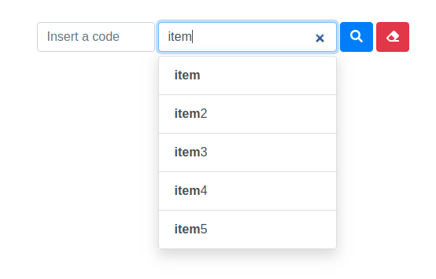

# *Seeker*

### **Aboult**
A simple plugin to simplify object search

### **Desenvolvedores**

 - Thiago Henrique Felix

### **Project status**

 - Under development

### **License**
Licensed [MIT.](https://opensource.org/licenses/GPL-3.0)

### **Seeker images**


## Project setup
```
npm install
```

### Compiles and hot-reloads for development
```
npm run serve
```

### Compiles and minifies for production
```
npm run build
```

### Run your unit tests
```
npm run test:unit
```

### Lints and fixes files
```
npm run lint
```

### Customize configuration
See [Configuration Reference](https://cli.vuejs.org/config/).
